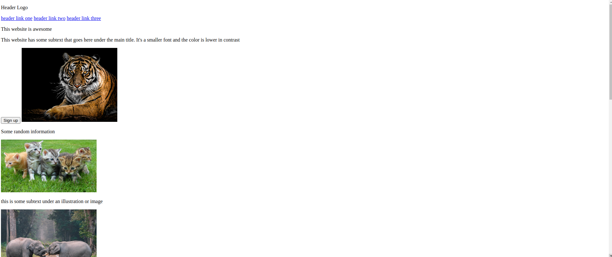
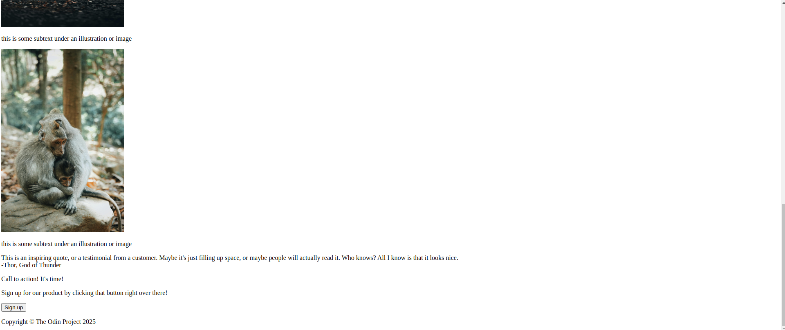

# 02_landing-page

link to the page: https://chinmay0303.github.io/02_landing-page/

Trying to create a landing page using flexbox.
First I will create a basic structure of the page using HTML
then I will try to style each section of the page one by one.

I have created a basic structure for the page in index.html.
But I have a confusion regarding which element to use for texts. At some places I have used p tags, at others I have used div tags. I don't know if I have to change this during styling with CSS.

Also I will have to edit the index.html again as required during stying: Creating new containers, assigning classes, etc.

Template design for the page:

I have not changed the placeholder texts at all as it wasn't significant and I have put random images of animals.
This page is not very responsive at the moment as I don't know that much.

Image credits:

Photo by GEORGE DESIPRIS from Pexels: https://www.pexels.com/photo/close-up-photography-of-tiger-792381/

Photo by Pixabay from Pexels: https://www.pexels.com/photo/assorted-color-kittens-45170/

Photo by FUTURE KIIID from Pexels: https://www.pexels.com/photo/photo-of-elephants-on-grass-3551498/

Photo by Aleksey Kuprikov from Pexels: https://www.pexels.com/photo/monkeys-sitting-on-rock-3493730/

Photo by Alex Andrews: https://www.pexels.com/photo/photo-of-fox-sitting-on-ground-2295744/